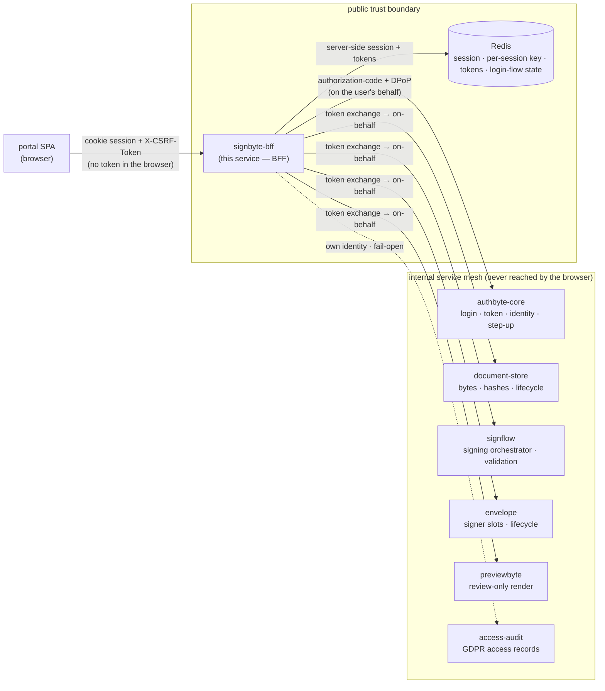
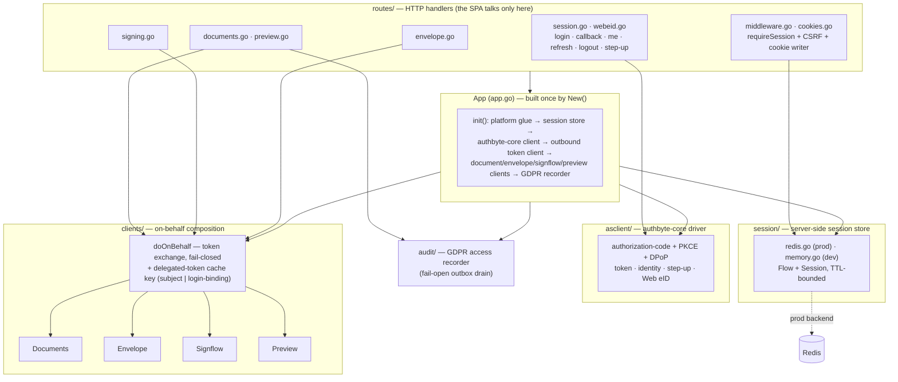
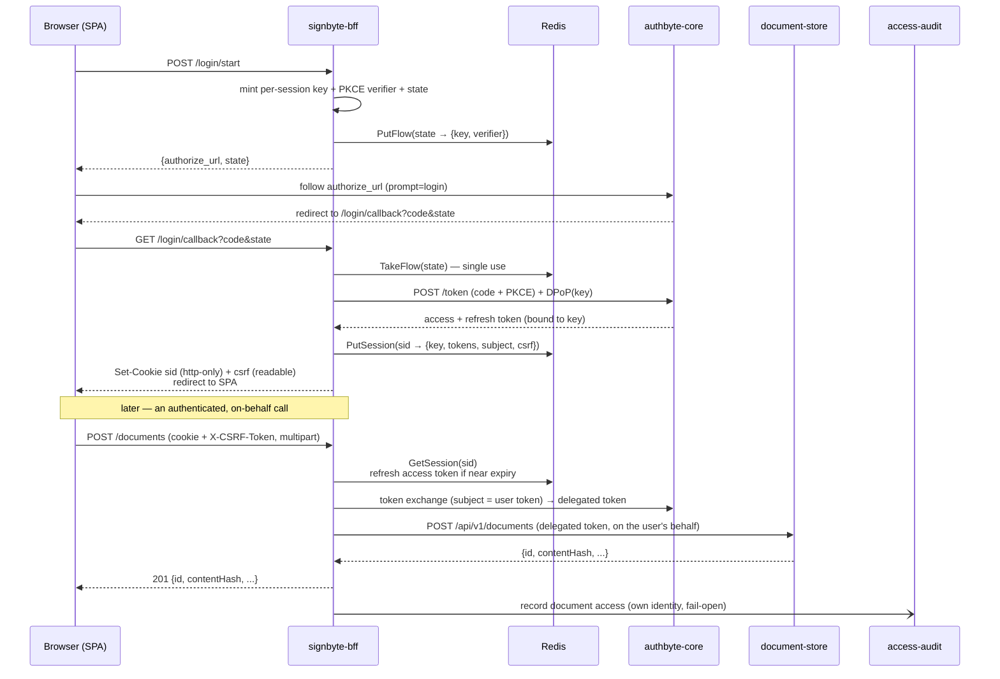

# signbyte-bff

The **browser-facing** service of the signing portal — the single public trust boundary the product single-page app (the SPA) talks to. It terminates the cookie session, drives the login against authbyte-core, and **composes** the domain services — document-store, signflow, envelope, previewbyte — into coarse-grained endpoints, each reached **on the acting user's behalf**. It is a Backend-for-Frontend (BFF): the one internet-facing edge in front of an otherwise cluster-internal service mesh.

The defining property is that **no token ever reaches the browser**. The SPA carries only an opaque, http-only session cookie plus a readable anti-forgery token; the access/refresh tokens and the per-session sender-constraint key are held server-side in Redis. A logged-in browser can drive the product, but it never holds a bearer credential it could replay or leak. Every server-side hop to authbyte-core proves possession of the per-session key ([DPoP, RFC 9449](https://www.rfc-editor.org/rfc/rfc9449)), and every downstream call is minted from the user's own token by [OAuth 2.0 Token Exchange (RFC 8693)](https://www.rfc-editor.org/rfc/rfc8693) so the service it reaches sees the *user's* identity, not this one's.

What it does **not** do: it holds **no durable relational data** (only a short-lived session + login-flow state in Redis), holds **no signing keys** (the card signs in the browser; the signature material lives in signflow), and stores **no document bytes** (it streams them through from document-store). It owns no schema; it composes services that do. Cross-cutting concerns — structured logging with redaction, tracing, correlation — are installed once by the shared platform-kit and are never wired per-handler.

---

## Where it sits

`signbyte-bff` is the only service the browser ever reaches. It fronts authbyte-core for login and identity, and composes four domain services on the user's behalf; it keeps its session + delegation state in Redis and emits user-facing access records to access-audit. The diagram is the full composition; in a skeleton/dev deployment the collaborator clients are simply absent until their base URLs are configured, and the routes report not-ready.



Division of labour: the SPA renders and holds no secrets; `signbyte-bff` owns everything at the public edge — session termination, anti-forgery, input validation, error projection, and the delegation that lets a user's own data reach the services that owner-filter on the acting user. authbyte-core owns authentication and token issuance; document-store, signflow, envelope, and previewbyte own their domains and each owner-filter on the delegated user subject. The two sides meet at the cookie boundary (browser ↔ BFF) and the delegated-token boundary (BFF ↔ mesh) — a delegated call that carries no subject token **fails closed** rather than falling back to this service's own identity.

---

## HTTP surface

Base path `/api/portal/v1`. The session is a cookie: **anonymous** endpoints establish it; the rest require a valid session cookie, and every state-changing call additionally requires a matching anti-forgery token echoed in `X-CSRF-Token`. Errors are projected to the public problem envelope — the originating service id and the internal hop chain are stripped before the body reaches the browser.

| Method + path | Auth | Purpose |
|---|---|---|
| `GET /healthz` | — | Liveness — 200 whenever the process is up |
| `GET /readyz` | — | Readiness — pings the session store; 503 `not_ready` when it is unreachable |
| `POST /api/portal/v1/login/start` | anonymous | Begin a redirect login: mint the per-session key + PKCE verifier + state, park them, return `{authorize_url, state}` |
| `GET /api/portal/v1/login/callback` | anonymous | Land the browser back, redeem the code for a key-bound token, set the session cookie, redirect to the SPA |
| `POST /api/portal/v1/login/webeid/start` | anonymous | Begin an eID-card login: mint the key + verifier, request a card challenge, park the flow, return `{nonce, state}` |
| `POST /api/portal/v1/login/webeid/complete` | anonymous | Redeem the card token (signed in the browser) for a key-bound token, establish the session, return `{ok}` |
| `GET /api/portal/v1/me` | session | The user's identity + permitted signing flows (composed from authbyte-core), plus seal availability when the login captured it: `can_eseal` (null = unknown, false = verifiably none) and `seals[{id,label}]` for the picker — certificates never reach the browser |
| `POST /api/portal/v1/session/refresh` | session + CSRF | Re-issue the access token within the session |
| `POST /api/portal/v1/logout` | session + CSRF | Invalidate the session, clear the cookies, return the front-channel logout URL |
| `POST /api/portal/v1/step-up` | session + CSRF | Ask authbyte-core to elevate to a stronger login method; relay its instruction to the SPA |
| `GET /api/portal/v1/dashboard` | session | The composed library view in one fetch: the signer inbox + the user's envelopes + their **standalone document chains** (one live-head row per chain; a chain covered by an envelope — owned **or** awaiting the user's signature as an invited signer — is subtracted server-side, so one envelope/chain = one row). A **terminal envelope whose documents' storage retention has destroyed** is dropped too: the record's home is history, and a live row over gone bytes could only offer actions that answer 410 |
| `POST /api/portal/v1/documents` | session + CSRF | Upload (multipart) on the user's behalf → `{id, contentHash, mime, size, preservationClass}` |
| `GET /api/portal/v1/documents` | session | List the user's own documents (`?limit` / `?after` keyset paging) |
| `GET /api/portal/v1/documents/{id}` | session | Document metadata (the user's own) |
| `GET /api/portal/v1/documents/{id}/chain` | session | One document **chain** as its live head, by any id in it: signed-ness (`hasSignatures` / `platformSigned`), preservation class, retention, the download freeze, and the head container's inner files. The document screen's source of truth — the dashboard listing represents a covered chain by its envelope and pages, so a screen must not take a chain's own facts from there |
| `GET /api/portal/v1/documents/{id}/download` | session | Stream the bytes (content type + filename relayed); records a GDPR access event |
| `POST /api/portal/v1/documents/{id}/archive-timestamp` | session + CSRF | Refresh the user's signed document with a qualified archive timestamp (B-LT → B-LTA) via the orchestrator; the document keeps its id. The session's auth certificate (login-captured, or the card login's) rides along — the timestamp request is made in the acting user's name |
| `POST /api/portal/v1/documents/{id}/validate` | session + CSRF | Validate a signed document on demand (e.g. a file uploaded already signed) → the normalized answer; nothing persisted |
| `POST /api/portal/v1/documents/bundle` | session + CSRF | Eager-bundle the staged loose uploads into ONE unsigned ASiC-E (the draft-save commit point) `{sourceIds[]}` in order → the bundle row; the loose sources are absorbed |
| `POST /api/portal/v1/documents/{id}/rebundle` | session + CSRF | Rebuild an unsigned bundle from `{entries[]}` in final order (an existing inner file by name, or a newly staged source by id) — a draft edit (add / remove / reorder) |
| `GET /api/portal/v1/documents/{id}/data-objects/{name}` | session | Extract one named inner file out of an ASiC-E container (re-stage / download an original). Declares the review purpose downstream, so it stays available while the chain's signed result is download-frozen mid-workflow (only an inner original is returned, never the signed container) |
| `POST /api/portal/v1/verify` | **public** | Verify an uploaded signed document without an account (multipart `file`): admission-gated (only a signed PDF / ASiC-E is forwarded; typed `422` reasons), size-capped (`413` before any proxying), rate-limited per client IP (`429`), then proxied to the signing service under this service's own identity and answered with the normalized validation report. Stateless — the bytes are never persisted here; every request leaves a purpose-scoped abuse-evidence event |
| `GET /api/portal/v1/history` | session | The user's history: terminal chains whose storage is destroyed, kept as records for the platform's bounded window (keyset paging) |
| `DELETE /api/portal/v1/history/{chainRoot}` | session + CSRF | Erase one history record early |
| `DELETE /api/portal/v1/documents/{id}` | session + CSRF | Delete before the retention window lapses |
| `GET /api/portal/v1/documents/{id}/preview` | session | Review-only preview manifest; records a GDPR access event |
| `GET /api/portal/v1/documents/{id}/preview/pages/{n}` | session | One rendered, inert page image (`Cache-Control: no-store`) |
| `GET /api/portal/v1/documents/{id}/preview/text` | session | Extracted plain-text layer |
| `GET /api/portal/v1/documents/{id}/data-objects/{name}/preview` | session | Review-only preview manifest for one inner file of an ASiC-E container |
| `GET /api/portal/v1/documents/{id}/data-objects/{name}/preview/pages/{n}` | session | One rendered, inert page image of an inner file |
| `GET /api/portal/v1/documents/{id}/data-objects/{name}/preview/text` | session | Extracted plain-text layer of an inner file |
| `GET /api/portal/v1/signings/{jobId}/status` | session | Poll to completion; `?wait=<s>` (clamped to 10s) turns it into a long-poll. During the device-push confirmation window (eID Scan) the body carries `verificationCode`, `verificationMessage` + `signingDeadline` — the code and prompt the SPA shows for the user to match on their phone |
| `POST /api/portal/v1/signings/{jobId}/client-signature` | session + CSRF | Submit the in-browser card signature(s) |
| `POST /api/portal/v1/signings/{jobId}/abandon` | session + CSRF | Release a stuck attempt's chain lock without declining |
| `GET /api/portal/v1/chain-free` | session | Long-poll (`?envelopeId`, `?wait`) until a co-sign chain is free to sign |
| `GET /api/portal/v1/signatures/{sigId}/validation` | session | The normalized validation verdict (relayed verbatim) |
| `POST /api/portal/v1/envelopes` | session + CSRF | Create a draft envelope `{title?, orderPolicy?, profile?, documents?[], slots?[]}` — 2+ `documents` are first bundled into ONE unsigned ASiC-E the envelope references → `{id, status, version, slotIds}` |
| `GET /api/portal/v1/envelopes` | session | List the user's own envelopes (`?limit` / `?cursor` keyset paging). `?documentId=` turns it into a targeted lookup: the envelopes covering that document which the user may see (owner or matched participant), newest first |
| `GET /api/portal/v1/signing-tasks` | session | The signer inbox — envelopes awaiting the user's signature as an invited co-signer |
| `GET /api/portal/v1/envelopes/{id}` | session | Composed detail → header + `slots[]` (each enriched with its live signing state) + `documents[]` |
| `POST /api/portal/v1/envelopes/{id}/documents` | session + CSRF | Attach a document `{documentId}` (draft-only) |
| `POST /api/portal/v1/envelopes/{id}/slots` | session + CSRF | Add a signer slot `{orderIndex, role?, flow?, requiredLoa?, identityRef?}` → `{id}` |
| `POST /api/portal/v1/envelopes/{id}/send` | session + CSRF | Leave draft for the active signing lifecycle → `{id, status, version}` |
| `POST /api/portal/v1/envelopes/{id}/cancel` | session + CSRF | Cancel the envelope → `{id, status, version}` |
| `POST /api/portal/v1/envelopes/{id}/reopen` | session + CSRF | Reopen a **completed** envelope so a further signature joins the workflow that already covers the container, instead of a new envelope per signing run → `{id, status, version}`. Owner only; anything but `completed` answers `409 err:envelope:invalidState`. Reopening does not open signing — add the slot and send, and the send is what grants the new signer access to the document |
| `POST /api/portal/v1/envelopes/{id}/slots/{slot}/decline` | session + CSRF | A signer declines a slot → drives the envelope to `declined` |
| `POST /api/portal/v1/envelopes/{id}/slots/{slot}/sign` | session + CSRF | Trigger signing for an eligible slot (ordering-gated; `409 not_eligible` before its turn) `{documentId, flow, sigFormat, sealId?}` → `{jobId, state, authorizeUrl?}`. `sealId` picks which seal signs (the e-seal flow when the person holds several; ids from `/me`). Redirect flows are silently enriched with the login-captured identity + certificates so the signing provider skips its own identity-resolution leg; absent capture, the provider resolves identities itself as before |

Each composed route reports `503 …notConfigured` until its collaborator base URL is wired — the surface is registered but fails closed by absence, so a half-configured deployment cannot silently drop delegation.

---

## Architecture

One application object (`App` in [`app.go`](app.go)) wires every dependency at startup. The session store, the authbyte-core client, the outbound delegated-token client, and the four collaborator clients are each constructed once; a missing collaborator base URL leaves that client `nil` and its routes fail closed. The composed service clients share one delegation primitive (`clients.doOnBehalf`) so the fail-closed rule (no subject token ⇒ no call) is enforced in exactly one place.



---

## Login → cookie session → on-behalf composed call

A redirect login, then an upload composed on the user's behalf. The eID-card login differs only at the front: the card handshake runs in the browser and completes over `webeid/complete` rather than a browser navigation, but redeems the same key-bound token.



---

## Session & delegation model

**To the browser** the service hands two cookies and nothing else. `portal_session` is an opaque, http-only session id — never a token, so script cannot read it and it cannot be replayed as a bearer credential. `portal_csrf` carries a per-session anti-forgery token that is deliberately **readable** by the SPA, which echoes it in `X-CSRF-Token` on every state-changing call; the handler compares it to the value minted for that session and rejects a mismatch (`403 err:session:csrf`). Both cookies are `SameSite=Lax`, `Secure` over TLS, and site-scoped — the layered defence of the [BFF pattern](https://datatracker.ietf.org/doc/html/draft-ietf-oauth-browser-based-apps) against cross-site request forgery on a cookie session.

**Server-side** each session holds the per-session **sender-constraint key** (a freshly generated EC key, PKCS#8-serialized), the access/refresh tokens, the person's subject, the anti-forgery token, for a card login the card's authentication certificate captured at login, and — when the auth service captured one — the login's signing-capability set (sign identity, certificates, seals), stored on the code exchange, kept across refreshes, replaced on step-up, gone on logout. The capability certificates carry personal data: they stay server-side and are never logged. Every call `signbyte-bff` makes to authbyte-core (token, identity, step-up) carries a fresh [DPoP (RFC 9449)](https://www.rfc-editor.org/rfc/rfc9449) proof of possession of that key, retrying once on a server-issued nonce; the tokens are therefore useless without the key, and the key never leaves the server. Login uses the OpenID Connect authorization-code flow with [PKCE (RFC 7636)](https://www.rfc-editor.org/rfc/rfc7636) `S256`, and always sends `prompt=login` so a lingering upstream SSO session cannot silently answer with a different login method than the one requested (the login method binds which signing flows are permitted).

**To reach a domain service** the handler exchanges the user's access token for a downstream token that carries the *user's* identity, via [OAuth 2.0 Token Exchange (RFC 8693)](https://www.rfc-editor.org/rfc/rfc8693). document-store, envelope, signflow, and previewbyte each owner-filter on that delegated subject, so the user's own data is reachable and no cross-user access is possible. A call with no subject token does not fall back to this service's identity — it fails closed. The delegated token is cached (in the outbound client) keyed by **subject plus a login-binding discriminator** (`login_method` + `loa`): a delegated token bakes in those claims, and a person's subject is stable across login methods, so keying on subject alone would let a re-login with a *different* method reuse a token carrying the *old* method — which signflow's login-to-flow binding check would then reject. The binding never changes the audited actor (the subject); it only scopes the cache.

---

## State and data model

`signbyte-bff` **owns no relational schema**. Its only persistent state is a short-lived, TTL-bounded footprint in Redis; everything durable lives in the services it composes.

| Key | Value | TTL | Role |
|---|---|---|---|
| `portal:flow:{state}` | login-in-progress: the per-session key + PKCE verifier (+ session id for a step-up) | `FLOW_TTL` (10m) | write on login start; single-use `GETDEL` on callback |
| `portal:sess:{id}` | logged-in session: per-session key, access/refresh tokens + expiry, subject, anti-forgery token, card auth cert | `SESSION_TTL` (12h) | write on login; read on every authenticated request; deleted on logout |

The login flow is redeemed with an atomic get-and-delete, so a replayed callback finds nothing. In development, an in-memory store backs the same interface (it does **not** survive a restart and does **not** scale past one instance); production must set `REDIS_URL`.

---

## Configuration

Standard fleet env (`SERVER_URLS`, `SERVICE_NAME`, `ENVIRONMENT`, `LOG_*`, `OTEL_*`, `METRICS_ENABLED`) comes from the shared base configuration, plus:

| Env var | Default | Meaning |
|---|---|---|
| `AUTH_ISSUER_URL` | — (required) | authbyte-core public base — the browser authorization redirect + the trusted token issuer |
| `AUTH_INTERNAL_URL` | — (⇒ issuer) | In-network authbyte-core address for server-side token/identity/step-up calls + the DPoP proof URL; falls back to the issuer when no proxy sits between them |
| `AUTH_CLIENT_ID` | `portal-spa` | Public client id presented in the authorization-code flow |
| `AUTH_REDIRECT_URI` | — (required) | Registered callback the browser is returned to after authentication |
| `POST_LOGIN_URL` | — (required) | Where the browser is sent after a successful login (the SPA entry point); also derives the logout + signing-return origin |
| `SIGNING_RETURN_BASE_URL` | — (⇒ POST_LOGIN_URL origin) | App origin a redirect-flow signing provider returns the browser to (always BFF-controlled — no open-redirect surface) |
| `REDIS_URL` | — (empty ⇒ in-memory, dev only) | Backs the session + login-flow store |
| `SESSION_TTL` | `12h` | Logged-in session lifetime |
| `FLOW_TTL` | `10m` | Window a login may take from start to callback |
| `COOKIE_NAME` | `portal_session` | Name of the http-only session cookie (the anti-forgery cookie is `portal_csrf`) |
| `SERVICE_CLIENT_ID` | `svc:portal-api` | Outbound service-client id authenticating the token-exchange requests |
| `SERVICE_CLIENT_SECRET` | — | Outbound client secret. Secret: supports the `SERVICE_CLIENT_SECRET_FILE` convention (an explicit plain value still overrides it) |
| `OUTBOUND_ISSUER_URL` | — (⇒ issuer) | In-network address for the outbound token mint (the trusted issuer stays authbyte-core) |
| `DOCUMENT_BASE_URL` · `ENVELOPE_BASE_URL` · `SIGNFLOW_BASE_URL` · `PREVIEW_BASE_URL` | — | Collaborator base URLs; each unset ⇒ its routes fail closed with `503 …notConfigured` |
| `DOCUMENT_AUDIENCE` · `ENVELOPE_AUDIENCE` · `SIGNFLOW_AUDIENCE` · `PREVIEW_AUDIENCE` | `svc:document` · `svc:envelope` · `svc:signflow` · `svc:preview` | Target audience for each collaborator's delegated token |
| `ACCESS_AUDIT_URL` | — (empty ⇒ recording off) | access-audit base URL; unset disables GDPR access recording (dev). The public verify flow's abuse-evidence events post to the same service (`/v1/verify-events`, scope `verify-audit:write`) and are disabled with it |
| `ACCESS_AUDIT_AUDIENCE` | `svc:access-audit` | Audience of the outbound service token to access-audit |
| `ACCESS_AUDIT_SCOPE` | `access-audit:write` | Scope requested on that token |
| `ACCESS_AUDIT_OUTBOX_DIR` | — (⇒ in-memory) | When set, buffers undelivered access records to disk for crash-durable background retry |
| `SIGNER_BASE_URL` | — (empty ⇒ verify off) | Signing-service base URL for the public verify proxy; unset ⇒ `POST /verify` fails closed with `503`. The verify call runs client-credentials (no user on the path) under a 90s per-call ceiling — long-term-archival validations legitimately run tens of seconds |
| `SIGNER_AUDIENCE` | `svc:eparaksts-signer` | Audience of the outbound service token for the verify call |
| `VERIFY_MAX_BYTES` | `26214400` (25 MB) | Upload cap on `POST /verify`, rejected before any proxying |
| `VERIFY_RATE_PER_MINUTE` · `VERIFY_RATE_BURST` | `6` · `3` | Per-client-IP token bucket on `POST /verify` |
| `VERIFY_CONCURRENT_PER_IP` | `1` | In-flight `POST /verify` requests allowed per client IP |
| `VALIDATION_CACHE_TTL` | `5m` | Render-recent window for validation answers: a repeat fetch of an answer that just passed through here is served from cache (Redis when configured, else in-process) instead of re-running the upstream validation round. `?force=1` on the validation endpoints bypasses and refreshes it; answers carry their `validatedAt`. `0` disables |

**TLS is selected by the URL scheme.** `rediss://…` connects over TLS; `redis://…` does not. `skip_verify=true` only relaxes certificate verification on a `rediss://` URL — on a `redis://` URL the client rejects it outright (`redis: unexpected option: skip_verify`) rather than silently upgrading the connection. Earlier Azugo versions did treat `skip_verify=true` as an implicit request for TLS; that side-effect is fixed from **Azugo v0.37** onwards, so a TLS endpoint must always be addressed as `rediss://`.

The outbound delegated-token client is built only when at least one collaborator base URL is set; GDPR recording is wired only when `ACCESS_AUDIT_URL` **and** an outbound client are both present (otherwise the recorder is a safe no-op).

---

## Directory layout

```
signbyte-bff/
├── app.go, config.go, auditposter.go, testing.go   — App container, config, audit poster, test harness
├── cmd/server/                                      — CLI entrypoint (web default, health subcommand)
├── routes/                                          — HTTP handlers (the only surface the SPA reaches)
│   ├── session.go, webeid.go   — login · callback · me · refresh · logout · step-up
│   ├── documents.go, preview.go — document + review-only preview passthroughs (on-behalf)
│   ├── signing.go              — signing-job status · client signature · abandon · validation
│   ├── envelope.go             — multi-signer envelopes + composed detail view
│   ├── middleware.go, cookies.go — requireSession + CSRF gate, session-cookie writer
│   ├── health.go, router.go    — probes + route registration + downstream error relay
│   ├── request/, response/     — request/response DTOs
├── session/                                         — server-side session store
│   ├── session.go   — Store interface, Flow + Session, key (de)serialization
│   ├── redis.go     — production store (TTL-bounded, GETDEL single-use flow)
│   └── memory.go    — in-memory store (development/test)
├── asclient/                                        — authbyte-core driver (auth-code + PKCE + DPoP + Web eID + step-up)
├── clients/                                         — on-behalf composition (token exchange, fail-closed)
│   ├── clients.go   — doOnBehalf + delegated-token cache keying
│   ├── document.go, envelope.go, signflow.go, preview.go
├── audit/                                           — GDPR access recorder + background outbox drain
├── Dockerfile, go.mod, go.sum
```

---

## Development

There is no Makefile; the toolchain is plain Go plus a Dockerfile that produces one static binary on a minimal rootless scratch base.

```bash
go build ./...            # build
go test ./...             # unit + handler tests (in-process fakes; no Docker/network)
go vet ./...              # vet
docker build -t signbyte-bff .   # one static binary on rootless scratch (nonroot)

/server web               # serve (the default subcommand)
/server health            # health-probe subcommand (used by the container HEALTHCHECK)
```

The test suite runs entirely against in-process fakes — an in-memory session store, stub outbound doers for the collaborator clients, and stub authbyte-core responses — so it needs no Docker or network. Observability (metrics on `/metrics`, traces, log redaction, correlation) is provided by the shared platform-kit; the service registers no custom metrics of its own.

---

## Security invariants

- **No token in the browser** — the browser holds only an opaque http-only session id and a readable anti-forgery token; the sender-constraint key and the access/refresh tokens stay server-side in Redis.
- **Sender-constrained calls** — every server-side hop to authbyte-core carries a fresh DPoP proof of possession of the per-session key ([RFC 9449](https://www.rfc-editor.org/rfc/rfc9449)); the tokens are worthless without the key.
- **On-behalf delegation, fail-closed** — downstream calls are minted from the user's token by token exchange ([RFC 8693](https://www.rfc-editor.org/rfc/rfc8693)) so services owner-filter on the acting user; a call with no subject token is refused, never downgraded to this service's own identity.
- **Anti-forgery on every mutation** — state-changing requests must echo the per-session anti-forgery token in `X-CSRF-Token`; combined with `SameSite=Lax` cookies this closes the cross-site request-forgery surface of a cookie session.
- **Refusals only this edge can see become typed security events** — an anti-forgery rejection on a live session (`authz.denied`, naming the session's subject) and a public-verify rate-limit trip (`edge.block`, with the client IP and rule) are emitted as structured security events into the log stream, distinct from plain request logs, so abuse against the anonymous surface and the CSRF shape are triageable in the SIEM. Emission is best-effort — the refusal itself never depends on it. An expired-session 401 stays a request log on purpose: it is the normal re-login path, and recording it as a security event would bury the real signals.
- **No open-redirect surface** — the login return, logout return, and signing-return URLs are all built from this service's own configuration, never from client-supplied input.
- **Public-error projection** — as the internet-facing edge, the service strips the originating service id and internal hop chain and withholds internal occurrence detail before any error body reaches the browser; a downstream server error becomes a gateway error (502) that still carries a traceable terminal envelope.
- **Holds nothing durable or secret** — no signing keys, no document bytes, no relational schema; only TTL-bounded session + flow state.
- **GDPR access recording is fail-open** — an interactive personal-data reveal (a download or a preview open) is recorded with the person as the actor, but a recording failure never blocks the user's action.
- **Downloads guarantee nosniff independently** — the document download route sets `X-Content-Type-Options: nosniff` at this boundary too, not just by relaying what the document service sent, so a stored file can never come back capable of running as a script.

---

## Known limitations

- **Single-instance session store in dev** — without `REDIS_URL` the in-memory store does not survive a restart and does not scale past one instance; it is development-only. Production must set `REDIS_URL`.
- **Downstream status granularity is relayed, not re-derived** — the BFF relays a downstream problem envelope's terminal code and maps a downstream 5xx / unreachable upstream onto a 502; it does not itself re-classify a domain error.
- **Slot live-state and filename enrichment are best-effort** — the composed envelope view reads each slot's live signing state and resolves document filenames per item; a miss on either leaves that field empty rather than failing the whole view.
- **GDPR access recording covers interactive reveals only** — document download and preview open are recorded here; background service-to-service reads are recorded by the service that performs them, not by this boundary.
